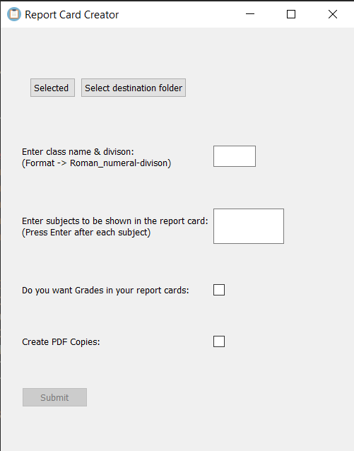
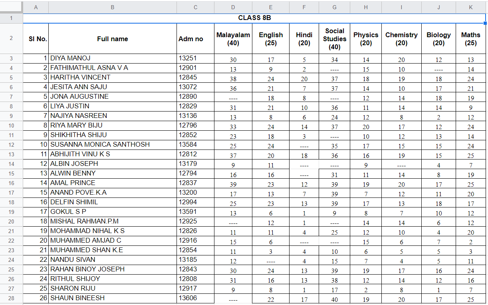

# Report Card Creator
A simple GUI made using Python that creates a report card for each student in an excel sheet (made it to help my mom) of a certain format given **the following info:** 
* Excel File 
* Directory to save the report card files 
* Class name 
* Subjects 
* Maximum marks for each subject 
* Do you want grades to be generated automatically in the report cards? 
* Do you want to convert the report card .docx files to PDFs? 

**Specifications for the Excel sheet:** 
* The row containing the column names (Full name, subjects...) should be the 2nd row. The 1st row can contain another heading like the class name or can be left empty. 
* The column containing the students' names should have a name of "Full name". 
* No two subjects should have the same first three letters. 
	

### GUI

### A sample Excel Sheet that would work with this program

## Tech Stack used:
* Python 
* PyQt5 module
* Pandas module
* docx module
* docx2pdf module
* Microsoft Excel
* Microsoft Word
* Google Sheets