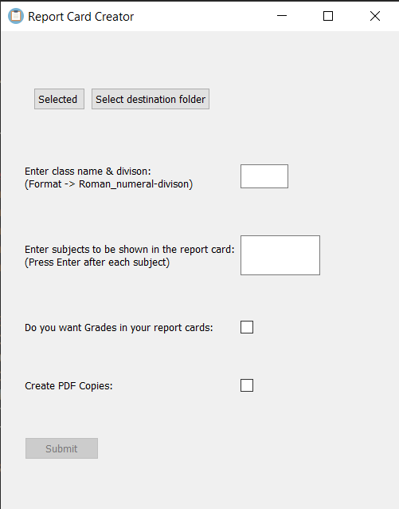

# Report Card Creator
A simple GUI made using Python that creates a report card for each student in an excel sheet (made it to help my mom) of a certain format given the following info:
	- Excel File
	- Directory to save the report card files
	- Class name
	- Subjects
	- Maximum marks for each subject
	- Do you want grades to be generated automatically in the report cards?
	- Do you want to convert the report card .docx files to PDFs?

### GUI
